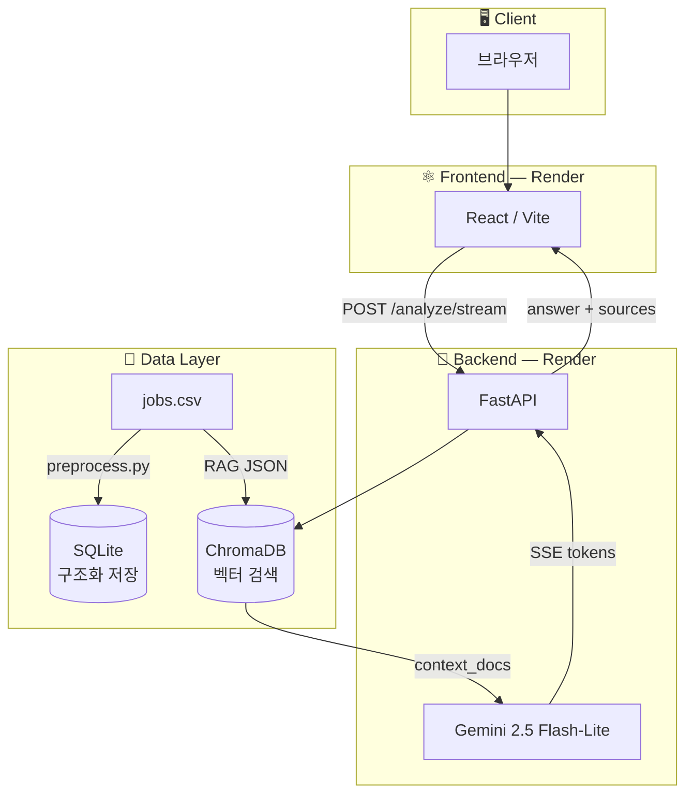
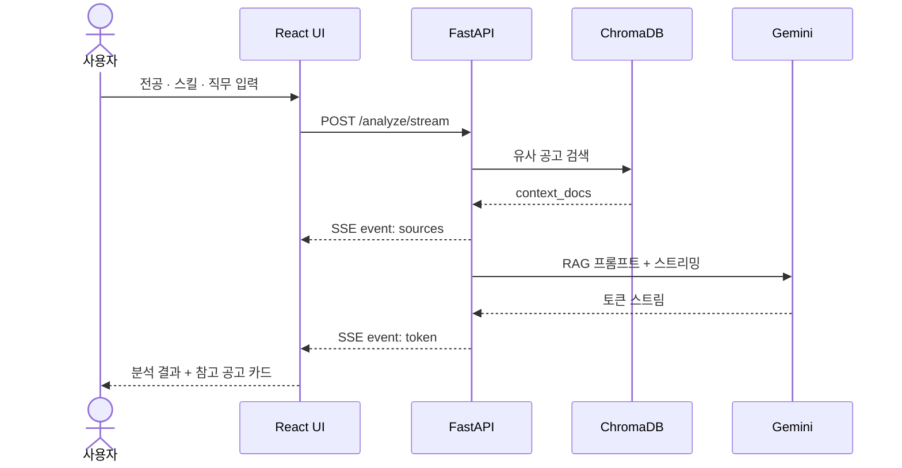

# CareerFit AI

> 취업·공모전 데이터 기반 맞춤형 AI 포트폴리오 코치

[Python](https://www.python.org/)
[FastAPI](https://fastapi.tiangolo.com/)
[React](https://react.dev/)
[Gemini](https://ai.google.dev/)
[Docker](https://www.docker.com/)
[Render](https://render.com/)


---

## 📌 프로젝트 개요

취업을 준비하는 과정에서 전공·스킬에 맞는 **채용 공고**를 여러 사이트에서 일일이 찾아야 하고, AI가 추천해 준 결과의 **근거와 출처**를 확인하기 어렵다는 문제가 있다. 공모전 정보도 분산되어 있어 맞춤 탐색이 비효율적이다.

사용자가 전공·스킬·관심 직무를 입력하면 **ChromaDB RAG**로 관련 공고를 검색하고, **Gemini**가 검색된 문서를 근거로 맞춤 조언을 생성한다. 분석에 참고한 공고는 `sources`로 함께 반환해 UI에서 확인할 수 있다.

> 현재 RAG 검색은 **채용 공고**만 연동되어 있으며, 공모전 데이터는 수집·전처리 완료 후 향후 반영 예정이다.

---

## 🛠 기술 스택


| 영역     | 기술                                |
| ------ | --------------------------------- |
| 백엔드    | Python 3.11, FastAPI, Uvicorn     |
| AI API | Gemini 2.5 Flash-Lite, RAG Prompt |
| 데이터    | Pandas, SQLite, ChromaDB          |
| 프론트엔드  | React, Vite, Tailwind CSS         |
| 실행 환경  | Docker, Render                    |


---

## 🏗 아키텍처

### 시스템 구조




### 분석 요청 흐름




---

## 🚀 실행 방법

### Docker로 실행 (권장)

**백엔드**

```bash
cd backend
docker build -t careerfit-ai .
docker run -p 8080:8080 --env-file .env careerfit-ai
```

**프론트엔드**

```bash
cd frontend
docker build -t careerfit-frontend .
docker run -p 3000:3000 -e PORT=3000 careerfit-frontend
```


| 서비스    | 접속 URL                                                   |
| ------ | -------------------------------------------------------- |
| API 문서 | [http://localhost:8080/docs](http://localhost:8080/docs) |
| 프론트엔드  | [http://localhost:3000](http://localhost:3000)           |


> 환경 변수는 `backend/.env.example`, `frontend/.env.example`을 참고해 `.env` 파일을 생성한다.

### 로컬 실행

**터미널 1 — 백엔드**

```bash
cd backend
source venv/bin/activate
uvicorn main:app --reload --port 8080
```

**터미널 2 — 프론트엔드**

```bash
cd frontend
npm install && npm run dev
```


| 서비스    | 접속 URL                                                   |
| ------ | -------------------------------------------------------- |
| API 문서 | [http://localhost:8080/docs](http://localhost:8080/docs) |
| 프론트엔드  | [http://localhost:5173](http://localhost:5173)           |


---

## 📊 데이터 파이프라인

```
jobs.csv (18건)
  → Pandas 전처리 (결측·중복 제거, 스킬 표준화)
  → SQLite (15건, 구조화 저장)
  → ChromaDB (15건, 벡터 검색)
  → Gemini 답변 생성
```

전처리 실행:

```bash
cd backend && python data/preprocess.py
```

---

## ✨ 주요 기능

- **RAG 기반 역량 분석** — 취업 공고 데이터를 근거로 맞춤형 커리어 조언 제공
- **출처 표시** — 분석에 참고한 공고를 `sources`로 함께 반환하고 UI에 카드로 표시
- **SSE 스트리밍** — `/analyze/stream`으로 AI 답변을 실시간 출력
- **Mock Mode** — API 키 없이도 `MOCK_MODE=true`로 전체 흐름 테스트 가능

---

## 📁 프로젝트 구조

```
careerfit_ai_new/
├── backend/                 # FastAPI 서버
│   ├── main.py
│   ├── routers/             # health · jobs · analyze
│   ├── services/            # llm_service · rag_service
│   ├── data/                # CSV · 전처리 · RAG 문서
│   └── Dockerfile
├── frontend/                # React UI
│   ├── src/components/      # InputForm · ResultCard · SourceCard
│   └── Dockerfile
├── harness/                 # AI 개발 하네스
└── docs/                    # 기획 · 체크리스트 · 배포 가이드
```

---

## 🔮 향후 개선

- [ ] 이력서 PDF 업로드 후 자동 역량 추출
- [ ] 공모전 마감일 알림 기능
- [ ] RAG 검색 품질 평가 지표 추가

---

## 📝 개발 과정

Docker 기반 Render 배포와 프론트엔드 CORS 연동이 가장 어려웠다. 백엔드 `FRONTEND_ORIGINS`와 프론트 `VITE_API_BASE_URL`을 분리 설정하고, Render 콜드 스타트 시 `/health`로 서버를 먼저 깨운 뒤 분석 요청을 보내는 방식으로 해결했다.

---

## 🌐 Demo


|           | 링크                                                                                         |
| --------- | ------------------------------------------------------------------------------------------ |
| Live Demo | [https://careerfit-ai-f.onrender.com](https://careerfit-ai-f.onrender.com)                 |
| API       | [https://careerfit-ai-2vpe.onrender.com](https://careerfit-ai-2vpe.onrender.com)           |
| Swagger   | [https://careerfit-ai-2vpe.onrender.com/docs](https://careerfit-ai-2vpe.onrender.com/docs) |


---

## 👤 Developer


|                |                                                               |
| -------------- | ------------------------------------------------------------- |
| **Name**       | 도현                                                            |
| **Role**       | Backend / AI Service Development                              |
| **GitHub**     | [@Dovcl](https://github.com/Dovcl)                            |
| **Repository** | [careerfit_ai_new](https://github.com/Dovcl/careerfit_ai_new) |
| **Email**      | [dobi8623@uos.ac.kr](mailto:dobi8623@uos.ac.kr)               |


